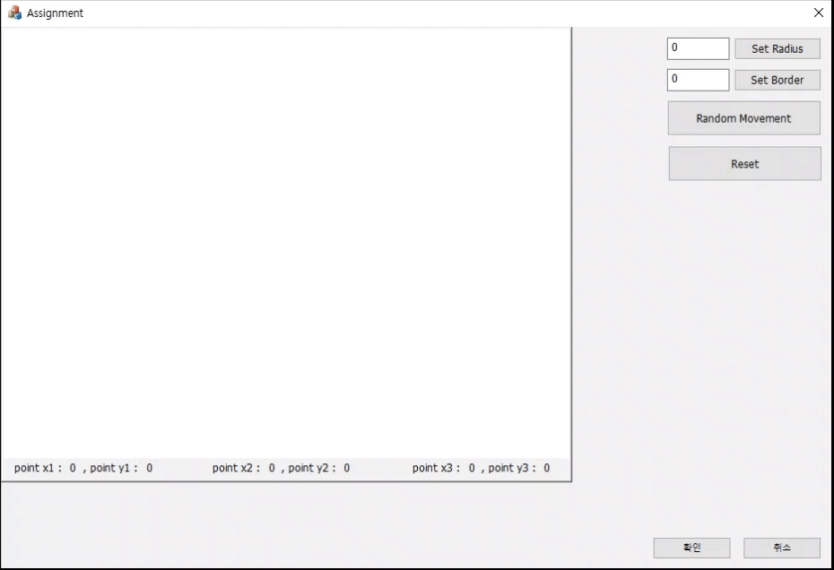

# MFC 기반 정원 그리기 프로그램

## 개요
이 프로젝트는 **MFC Dialog 기반 애플리케이션**으로, 사용자 입력과 마우스 이벤트를 활용하여 **세 개의 클릭 지점(중심점)을 지나가는 정원**을 그리는 프로그램입니다. 정원을 그린 후에도 정원을 클릭하여 **드래그**기능을 통해 동적으로 조작할 수 있으며, 별도의 **쓰레드를 활용**하여 UI 프리징 없이 자동 랜덤 이동을 구현하였습니다.

## 과제 결과물

| 실행 화면 |
|:---:|
|  |

## 배운 점 

1. **마우스 이벤트 처리 및 실시간 UI 업데이트**  
   - 클릭 지점 기록 및 드래그 시 실시간으로 UI를 업데이트하는 방법을 배웠습니다.  
   - **Invalidate**나 **UpdateData()** 등을 활용하는 것이 아닌 **CImage 클래스 객체**로 화면을 갱신하고 깜빡임을 최소화하는 기법을 배웠습니다.

2. **메모리 주소 직접 접근을 통한 이미지 처리**  
   - 기존에는 CDC 클래스를 이용하여 이미지를 처리했었는데, 이번 과제를 통해 **메모리 주소로 직접 접근하여 그리는 방법**을 배웠습니다.  
     이 방식을 적용하여 보다 직접적이고 세밀한 컨트롤이 가능함을 경험하였습니다.

3. **멀티스레드 프로그래밍 (UI 프리징 방지)**  
   - 유투브 영상을 통해 알게 된 `std::thread`를 활용법을 이용하여 별도의 스레드에서 랜덤 이동을 구현하며 MFC에서 스레드의 사용법을 배웠습니다. 

## 어려웠던 점 및 해결 방안

1. **세 점을 지나는 원 계산**  
   - 처음에는 각 원의 중심 좌표들을 더해 3으로 나누면 될 줄 알았습니다.
   - 하지만 **외접 삼각형**을 이용하는 공식을 사용해야 한다는 것을 알게되어 공식을 적용 후 해결하였습니다.  

2. **마우스 드래그 이벤트 처리**  
   - 처음에는 다이얼로그를 하나만 만들어 과제를 진행 중 클릭된 지점을 움직이며 선택 영역 밖으로 Elipse가 그려지는 이슈가 발생하였습니다.
   - CRect의 함수 중 IntersectClipRect를 호출하면 기존 클리핑 영역과 새롭게 지정한 사각형이 겹치는 부분만 유지되며,
      이외의 영역에서는 그리기 작업이 수행되지 않는다는 것을 확인 후 적용하여 해결하였습니다.

3. **스레드 환경에서 UI 동기화 문제**
   - 메인 다이얼로그 클래스와 스레드 클래스 하나로 진행하던 중 스레드를 사용하면 UI 스레드와 충돌이 일어나는 것을 에러를 통해 확인하였습니다.
     이후, 다이얼로그를 하나 더 추가 후 버튼 클릭 기능 함수를 제외한 작업들을 child로 지정한 다이얼로그 클래스에서 진행하여 해결하였습니다.
   - **랜덤 이동 중** 세 점의 좌표가 갱신되지 않는다는 것을 확인하고, GetDlgItem()->SetDlgItemText, SetDlgItemInt 등을 이용하였지만
     오히려 UI가 프리징되는 현상이 발생하였고, postmessage를 통해 충돌을 피해 작업을 수행하였지만 마지막 10번째의 점들의 좌표만 갱신될 뿐 완전히 해결이 되지는 않았습니다.
